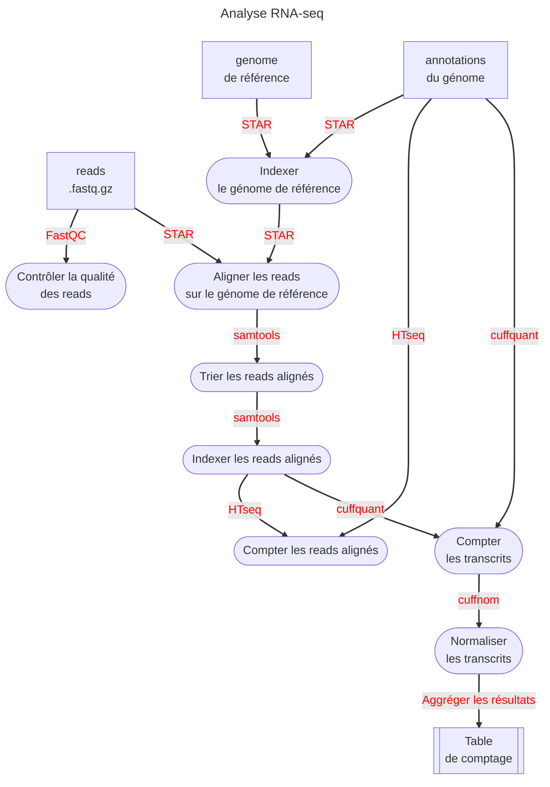

```mermaid
---
title: "Analyse RNA-seq"
---
flowchart TB
	read["reads \n .fastq.gz"]
    genome["genome \n de référence"]
    annotation["annotations \n du génome"]

    quality_control(["Contrôler la qualité \n des reads"])
    star_index(["Indexer \n le génome de référence"])
    star_map(["Aligner les reads \n sur le génome de référence"])
    samtools_sort(["Trier les reads alignés"])
    samtools_index(["Indexer les reads alignés"])
    htseq(["Compter les reads alignés"])
    cuffquant(["Compter \n les transcrits"])
    cuffnorm(["Normaliser \n les transcrits"])

    table[["Table \n de comptage"]]

    genome -->|"STAR"| star_index
    annotation -->|"STAR"| star_index
    
    read -->|"FastQC"| quality_control
    
    star_index -->|"STAR"| star_map
    read -->|"STAR"| star_map

    star_map -->|"samtools"| samtools_sort
    samtools_sort -->|"samtools"| samtools_index

    samtools_index -->|"HTseq"| htseq
    annotation -->|"HTseq"| htseq 
    samtools_index -->|"cuffquant"| cuffquant
    annotation -->|"cuffquant"| cuffquant
    cuffquant -->|"cuffnom"| cuffnorm
    cuffnorm -->|"Aggréger les résultats"| table 
    
    linkStyle default stroke-width:2px,fill:none,color:red;
```