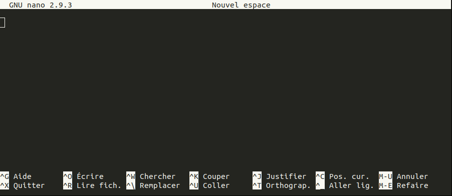

# Un rapide tour du shell Unix

Le *shell* Unix est un programme qui attend un ordre de la part de l'utilisateur, exécute cet ordre, affiche le résultat puis attend à nouveau un ordre. En anglais on parle de *REPL* pour *Read Execute Printe Loop*.

Le *shell* fonctionne sur un ordinateur, qui n'a aucune capacité d'abstraction ni d'intuition. Pour que ces ordres puissent être compris et exécutés, il faut qu'ils respectent des règles bien précises.

Un terminal ou une console est un logiciel graphique qui lance un *shell*.


## Invite de commande

Lorsque vous lancez un *shell*, l'invite de commande, c'est-à-dire la zone à gauche du curseur, ressemble à quelque chose du type :

```
pierre@jeera:~$
```
ou
```
pierre@orange $
```

Par convention, l'invite de commande sera désignée dans la suite par le caractère dollar `$` en tout début de ligne :
```
$
```
Il ne faudra pas taper ce caractère (lorsqu'il est en début de ligne)


## Exploration de répertoires et fichiers.

Pour reproduire ces exemples, voici les commandes à lancer pour récupérer et préparer les données utilisées :
```
$ cd
$ wget https://github.com/omics-school/unix/raw/master/demo/unix.tgz
$ tar zxvf unix.tgz
$ cd unix
```

Ces commandes seront expliquées ci-dessous.


### Savoir où on se trouve : `pwd`

La première commande à connaître est la commande `pwd` qui signifie *print working directory* et qui affiche le nom du répertoire courant.

Par exemple :
```
$ pwd
/home/pierre/unix
```
Cela signifie qu'on se trouve actuellement dans le répertoire `/home/pierre/unix`.

Sous Unix, les répertoires et les fichiers sont organisés sous forme d'une structure en arbre. On parle d'arborescence.

Le répertoire dont dépendent tous les autres est le `/` qu'on appelle la « racine » (*root* en anglais), les différents sous-répertoires sont séparés les uns des autres par le caractère `/`. Dans le cas de `/home/pierre/unix` :

- on se trouve dans le répertoire `unix`,
- qui est lui-même est un sous-répertoire du répertoire `pierre`,
- qui est lui-même est un sous-répertoire du répertoire `home`,
- qui est lui-même un sous-répertoire du répertoire `/` (la racine).

⚠️ **Attention** ⚠️ Ne confondez pas `/` qui tout au début signifie la racine de `/` qui sépare deux répertoires.

`/home/pierre/unix` est aussi appelé un « chemin » car il indique la succession des répertoires à suivre pour arriver jusqu'à `unix`.

Lorsqu'un chemin débute par `/` (la racine), on parle de **chemin absolu**. Il existe aussi des **chemins relatifs**, donc qui ne débutent pas par `/`, que nous verrons plus tard.


### Afficher le contenu d'un répertoire : `ls`

La commande `ls` (pour *list*) affiche le contenu d'un répertoire :
```
$ ls
genomes  paper.pdf  shopping_list.txt  transferrin.csv  transferrin.tsv
```

On peut modifier le comportement par défaut d'une commande avec une ou plusieurs option. Cette option est séparée de la commande par un ou plusieurs espaces.

Par exemple avec `-F` :
```
$ ls -F
genomes/  paper.pdf  shopping_list.txt  transferrin.csv  transferrin.tsv
```

Le caractère `/` a été ajouté à la fin de `genomes` pour indiquer qu'il s'agit d'un répertoire.

Remarquez que les commandes suivantes donneraient aussi le même résultats :
```
$ ls  -F
genomes/  paper.pdf  shopping_list.txt  transferrin.csv  transferrin.tsv
```
et pourquoi pas :
```
$ ls                                            -F
genomes/  paper.pdf  shopping_list.txt  transferrin.csv  transferrin.tsv
```

Il faut au moins un espace entre la commande et une option.

Une autre option sympa est l'option `-l` qui affiche des informations complémentaires sur le contenu du répertoire :
```
$ ls -l
total 152
drwxr-xr-x 2 pierre pierre 12288 mars  12 23:47 genomes/
-rw-r--r-- 1 pierre pierre 97830 mars  12 23:47 paper.pdf
-rw-r--r-- 1 pierre pierre    57 mars  13 00:36 shopping_list.txt
-rw-r--r-- 1 pierre pierre   940 mars  12 23:47 transferrin.csv
-rw-r--r-- 1 pierre pierre   940 mars  12 23:47 transferrin.tsv
```

L'option `-l` peut être associée à l'option `-h` pour afficher des tailles en octets, kilo, mega et giga octets.
```
$ ls -l -h
total 152K
drwxr-xr-x 2 pierre pierre 12K mars  12 23:47 genomes/
-rw-r--r-- 1 pierre pierre 96K mars  12 23:47 paper.pdf
-rw-r--r-- 1 pierre pierre  57 mars  13 00:36 shopping_list.txt
-rw-r--r-- 1 pierre pierre 940 mars  12 23:47 transferrin.csv
-rw-r--r-- 1 pierre pierre 940 mars  12 23:47 transferrin.tsv
```
Le fichier `paper.pdf` a une taille de 96 kilo octets.

Les options peuvent aussi être combinées :
```
$ ls -lh
total 152K
drwxr-xr-x 2 pierre pierre 12K mars  12 23:47 genomes/
-rw-r--r-- 1 pierre pierre 96K mars  12 23:47 paper.pdf
-rw-r--r-- 1 pierre pierre  57 mars  13 00:36 shopping_list.txt
-rw-r--r-- 1 pierre pierre 940 mars  12 23:47 transferrin.csv
-rw-r--r-- 1 pierre pierre 940 mars  12 23:47 transferrin.tsv
```

Une combinaison d'options intéressantes est `-lhrt` qui affiche en dernier le fichier modifié le plus récemment :
```
$ ls -lhrt
total 152K
-rw-r--r-- 1 pierre pierre 940 mars  12 23:47 transferrin.csv
drwxr-xr-x 2 pierre pierre 12K mars  12 23:47 genomes/
-rw-r--r-- 1 pierre pierre 940 mars  12 23:47 transferrin.tsv
-rw-r--r-- 1 pierre pierre 96K mars  12 23:47 paper.pdf
-rw-r--r-- 1 pierre pierre  57 mars  13 00:36 shopping_list.txt
```
L'option `-t` affiche les fichiers du plus récent au plus ancien et l'option `-r` inverse cet ordre.

L'option `-a` affiche tout le contenu du répertoire courant, notamment les fichiers et répertoires cachés qui commencent (sous Unix) par le caractère `.` :
```
$ ls -a
.  ..  genomes/  paper.pdf  shopping_list.txt  transferrin.csv  transferrin.tsv
```

Par défaut, il y a deux répertoires cachés qui sont toujours présents : `.` et `..`

Le répertoire `.` désigne le répertoire courant.

Le répertoire `..` désigne le répertoire parent. Par exemple, si on est dans le répertoire `/home/pierre/unix`, alors `..` désigne le répertoire `/home/pierre`.

Enfin, la commande `ls` permet de lister un répertoire passé en argument :
```
$ ls genomes
NC_000907_head.gbk  NC_004459_head.gbk  NC_007168_head.gbk  NC_011333_head.gbk
NC_000964_head.gbk  NC_004461_head.gbk  NC_007350_head.gbk  NC_011852_head.gbk
NC_002505_head.gbk  NC_004917_head.gbk  NC_009033_head.gbk  NC_012655_head.gbk
NC_002570_head.gbk  NC_006298_head.gbk  NC_009477_head.gbk  NC_013893_head.gbk
NC_002976_head.gbk  NC_006840_head.gbk  NC_011184_head.gbk  NC_014205_head.gbk
```

Comme pour les options, il faut au moins un espace entre une commande et son ou ses arguments.

On peut même d'obtenir des informations détaillées sur un fichier en particulier :
```
$ ls -lh paper.pdf
-rw-r--r-- 1 pierre pierre 96K mars  12 23:47 paper.pdf
```


### En savoir plus : `man`

La commande `man` (pour *manuel*) affiche l'aide associée à une commande. Par exemple pour la commande `ls` :
```
$ man ls
```
Utilisez les flèches <kbd>↓</kbd> et <kbd>↑</kbd> pour naviguer dans cette aide. La touche <kbd>Espace</kbd> saute une page à la fois. La touche <kbd>Q</kbd> quitte l'aide et revient au *shell*.


### Prêter attention aux noms de fichiers et répertoires

Sous Unix, les noms de fichiers et de répertoires sont sensibles à la casse, c'est-à-dire aux majuscules et aux minuscules. Par conséquent, le *shell* fait la différence entre le fichier `test.txt` et le fichier `Test.txt`.

Par ailleurs, l'extension de fichier est facultative et purement indicative. Le *shell* ne l'utilise pas. Elle sert simple à l'utilisateur pour mieux organiser ses fichiers. Un nom de fichier du type `test` ou `test.my_extension` est parfaitement valide. On peut même nommer un répertoire `directory.txt` (mais cela n'est pas très malin).

Enfin, pour nommer un fichier ou un répertoire, on peut utiliser :

- les lettres minuscules,
- les lettres majuscules,
- les chiffres,
- le tiret du milieu «`-`» (mais pas comme premier caractère du nom),
- le tiret du bas «`_`»,
- le point «`.`».

On vous déconseille fortement l'utilisation des autres caractères (`+()[]éèàùç`). Certains caractères sont même interdits (`<>|;&`).

Enfin, n'utilisez **jamais** un espace dans un nom de fichier ou de répertoire. **J-A-M-A-I-S**. Unix l'autorise mais c'est très très pénible par la suite car l'espace est utilisé pour séparer les options et les arguments d'une commande.

Pour le reste, laisser faire votre imagination et utilisez des noms de fichiers et de répertoires expressifs.

### Se déplacer : `cd`

La commande `cd` (pour *change directory*) permet de se déplacer d'un répertoire à l'autre. Par exemple :
```
$ pwd
/home/pierre/unix
$ cd genomes
$ pwd
/home/pierre/unix/genomes
```
Partant du répertoire `/home/pierre/unix`, on s'est déplacé dans le répertoire `/home/pierre/unix/genomes`.

Dans la commande `cd genomes`, le répertoire `genomes` est un argument de la commande Unix `cd`.

Dans la commande `cd genomes`, le répertoire `genomes` est un chemin relatif (car il ne débute pas par `/`). C'est-à-dire qu'on a entré le nom de ce répertoire (`genomes`) par rapport au répertoire dans lequel nous étions (`/home/pierre/unix`). Bien sûr, la commande `cd` fonctionne très bien avec un chemin absolu. La commande
```
$ cd /home/pierre/unix/genomes
```
conduirait au même résultat.

Un moyen simple de revenir dans le répertoire parent est d'utiliser le raccourci `..` :
```
$ pwd
/home/pierre/unix/genomes
$ cd ..
$ pwd
/home/pierre/unix
```

Un autre raccourci pratique pour revenir dans le répertoire utilisateur (répertoire par défaut dans lequel se trouve l'utilisateur lorsqu'il lance un *shell*) est `~` :
```
$ pwd
/home/pierre/unix
$ cd ~
$ pwd
/home/pierre
```

*Remarque* : simplement taper la commande `cd` ramène l'utilisateur dans son répertoire personnel.


### Créer un répertoire : `mkdir`

La commande `mkdir` (pour `make directory`) crée un répertoire :
```
$ ls
genomes/  paper.pdf  shopping_list.txt  transferrin.csv  transferrin.tsv
$ mkdir test
$ ls
genomes/  paper.pdf  shopping_list.txt  test/  transferrin.csv  transferrin.tsv
```

### Copier : `cp`

La commande `cp` (pour *copy*) copie un fichier vers un nouveau fichier :
```
$ ls
genomes/  paper.pdf  shopping_list.txt  transferrin.csv  transferrin.tsv
$ cp paper.pdf article.pdf
$ ls
article.pdf  genomes/  paper.pdf  shopping_list.txt  transferrin.csv  transferrin.tsv
```

`cp` peut copier plusieurs fichiers dans un répertoire :
```
$ cp paper.pdf article.pdf test
$ ls test
article.pdf  paper.pdf
```

`cp` peut aussi copier un répertoire dans un autre répertoire avec l'option `-r` :
```
$ cp -r genomes test
$ ls test
article.pdf  genomes/  paper.pdf
```


### Renommer et déplacer : `mv`

La commande `mv` (pour *move*) renommer des fichiers ou des répertoires :
```
$ ls
article.pdf  genomes/  paper.pdf  shopping_list.txt  test/  transferrin.csv  transferrin.tsv
$ mv article.pdf article2.pdf
$ ls
article2.pdf  genomes/  paper.pdf  shopping_list.txt  test/  transferrin.csv  transferrin.tsv
$ mv test test2
$ ls
article2.pdf  genomes/  paper.pdf  shopping_list.txt  test2/  transferrin.csv  transferrin.tsv
```

`mv` déplace aussi des fichiers ou des répertoires dans un autre répertoire :
```
$ ls
article2.pdf  genomes/  paper.pdf  shopping_list.txt  test2/  transferrin.csv  transferrin.tsv
$ mkdir test3
$ mv article2.pdf test2 test3
$ ls test3
article2.pdf  test2/
```


### Supprimer : `rm`

La commande `rm` (pour `remove`) supprime des fichiers ou des répertoires :
```
$ cd test3
$ ls
article2.pdf  test2/
$ rm article2.pdf
$ ls
test2/
$ rm -r test2
$ ls
```

Pour supprimer un répertoire, il faut utiliser l'option supplémentaire `-r`.

Suivant la configuration de votre *shell*, il faudra peut être ajouter l'option `-f` pour que la suppression fonctionne.

⚠️ **Attention** ⚠️ Il n'y a pas de corbeille dans le *shell* Unix, c'est-à-dire aucune possibilité de récupérer un fichier ou un répertoire effacé par erreur.


### Automatiser (un peu)

Les caractères `*` et `?` peuvent remplacer n'importe quels caractères dans les noms de fichiers ou de répertoires.

`*` remplace 0, 1 ou plus caractères.

`?` remplace exactement 1 caractère.

Par exemple :
```
$ ls transferrin.*
transferrin.csv  transferrin.tsv
$ ls transferrin.?sv
transferrin.csv  transferrin.tsv
```

Ces caractères sont très utiles quand il s'agit d'effectuer une opération sur plusieurs fichiers en même temps :
```
$ mkdir test4
$ cp transferrin.* test4
$ ls test4
transferrin.csv  transferrin.tsv
```

La commande `cp transferrin.* test4` est un raccourci pour
```
cp transferrin.csv  transferrin.tsv test4
```

Cela fonctionne avec deux fichiers mais aussi avec autant de fichiers que vous le souhaitez.


## Trucs et astuces

Écrire des commandes dans un *shell* peut sembler rébarbatif mais on gagne rapidement en efficacité avec les astuces suivantes.

### Rappel des anciennes commandes

La flèche du haut <kbd>↑</kbd> rappelle les commandes précédentes (depuis la plus récente jusqu'à la plus ancienne).

### Complétion automatique

La touche tabulation <kbd>Tab</kbd> est utile pour compléter une commande, un nom de répertoire ou de fichier. Appuyez deux fois sur <kbd>Tab</kbd> en cas d’ambiguïté.

Par exemple, si vous tapez `/h` puis la touche <kbd>Tab</kbd> et le *shell* va compléter automatiquement à `/home`.

### Arrêter une commande en cours

Pressez la touche <kbd>Ctrl</kbd> et la touche <kbd>C</kbd> en même temps pour arrêter une commande en cours.

### Copier / coller

Pour copier / coller quelque chose dans le *shell*, utilisez les combinaisons de touches <kbd>Ctrl</kbd>+<kbd>Maj</kbd>+<kbd>C</kbd> et <kbd>Ctrl</kbd>+<kbd>Maj</kbd>+<kbd>V</kbd>.


## Explorer le contenu de fichiers

Jusqu'à présent, nous nous sommes contentés d'afficher le contenu de répertoires et de déplacer ou copier des fichiers, sans connaître leur contenu.

Pour afficher le contenu d'un fichier, on utilise la commande `cat` (pour *concatenate*) :
```
$ cat shopping_list.txt
banana 6
pineaple  1
pear 3
apple 6
orange 4
```

Bien sûr, afficher le contenu d'un fichier n'a de sens ici que pour un fichier texte.

Afficher le contenu d'un fichier binaire produit une suite de caractères incompréhensibles :
```
$ cat paper.pdf
�{����e˿\�><?�S�;gg��>��ݻ���7��h�G�.�}{�������W[��5��͓����d�=8��f.���屌J�Y��b�ꂭ貾l���/ٙ�
xrefbjfalse/SM 0.02/Type/ExtGState>>
0 1
0000000000 65535 f
11 2
0000073672 00000 n
0000077288 00000 n
15 1
0000077496 00000 n
48 4
0000077860 00000 n
0000097345 00000 n
0000097389 00000 n
0000097434 00000 n
trailer
<</Size 52/Root 14 0 R/Info 12 0 R/ID[<C52AD85A8BAFBD722C6FCD30421B945E><33F927FA361D6A4FA1263C03468E9074>]/Prev 116>>
startxref
97487
%%EOF
```

⚠️ **Attention** ⚠️ Dans la suite, nous n'explorerons que le contenu de **fichiers textes**.

La commande `cat` n'a de sens que si le fichier est assez court. Si ce n'est pas le cas, le contenu du fichier va défiler d'un seul coup à l'écran, sans qu'on puisse en voir le début. Par exemple :
```
$ cat transferrin.csv
1TFD,Oryctolagus cuniculus,304
2D3I,Gallus gallus,686
2O84,Homo sapiens,337
3FGS,Homo sapiens,337
3QYT,Homo sapiens,679
3SKP,Homo sapiens,342
4H0W,Homo sapiens,679
4X1B,Homo sapiens,679
5H52,Homo sapiens,679
5WTD,Homo sapiens,679
5X5P,Homo sapiens,679
6CTC,Homo sapiens,679
```

La commande `less` affiche *progressivement* le contenu d'un fichier :
```
$ less transferrin.csv
```

Comme avec la commande `man`, les flèches <kbd>↓</kbd> et <kbd>↑</kbd> permettent de naviguer dans le contenu du fichier. La touche <kbd>Espace</kbd> saute une page à la fois. La touche <kbd>Q</kbd> quitte `less` et revient au *shell*.

La commande `head` affiche les premières lignes d'un fichier :
```
$ head transferrin.csv
1A8E,Homo sapiens,329
1A8F,Homo sapiens,329
1AIV,Gallus gallus,686
1AOV,Anas platyrhynchos,686
1B3E,Homo sapiens,330
1D3K,Homo sapiens,329
1D4N,Homo sapiens,329
1DOT,Anas platyrhynchos,686
1DTG,Homo sapiens,334
1FQE,Homo sapiens,331
```

Par défaut, `head` affiche les 10 premières lignes du fichier. L'option `-n` précise le nombre de lignes à afficher. Par exemple :
```
$ head -n 2 transferrin.csv
1A8E,Homo sapiens,329
1A8F,Homo sapiens,329
```

Réciproquement, la commande `tail` affiche les dernière lignes d'un fichier texte. L'option `-n` est également disponible :
```
$ tail transferrin.csv
2O84,Homo sapiens,337
3FGS,Homo sapiens,337
3QYT,Homo sapiens,679
3SKP,Homo sapiens,342
4H0W,Homo sapiens,679
4X1B,Homo sapiens,679
5H52,Homo sapiens,679
5WTD,Homo sapiens,679
5X5P,Homo sapiens,679
6CTC,Homo sapiens,679
```
```
$ tail -n 2 transferrin.csv
5X5P,Homo sapiens,679
6CTC,Homo sapiens,679
```

## Créer ou éditer un fichier texte

Nano est un éditeur de texte qui fonctionne dans un *shell*, donc sans interface graphique, sans menu, sans icône...

Pour le lancer, on utilise la commande `nano` :

```
$ nano
```

Et on obtient quelque chose du type :



Selon la version de votre système Unix, il se peut que l'interface soit en anglais mais les raccourcis clavier seront les mêmes.

On peut tout de suite commencer à taper du texte.

Pour sauvegarder le fichier ainsi créé, on utilise la combinaison de touches <kbd>Ctrl</kbd>+<kbd>O</kbd> (c'est-à-dire qu'on presse en même temps les touches <kbd>Ctrl</kbd> et <kbd>O</kbd>). On entre ensuite le nom qu'on souhaite donner au fichier (par exemple `test.txt`) puis on valide par la touche  <kbd>Entrée</kbd>.

On peut continuer à éditer le fichier puis l'enregistrer, et ainsi de suite.

Pour quitter nano, on utilise la combinaison de touches <kbd>Ctrl</kbd>+<kbd>X</kbd>.

On se retrouve alors dans le *shell* et on peut vérifier que le fichier (ici `test.txt`) a bien été créé dans le répertoire courant.

```
$ ls
genomes/  paper.pdf  shopping_list.txt  test.txt  transferrin.csv  transferrin.tsv
```

On peut aussi ouvrir un fichier texte existant en indiquant en argument le nom du fichier à ouvrir :

```
$ nano shopping_list.txt
```

## Manipuler des données

### Compter : `wc`

La commande `wc` (pour *word count*) compte le nombre de caractères, de mots et de lignes d'un fichier.
```
$ wc shopping_list.txt
 5 10 45 shopping_list.txt
```
On apprend ainsi que le fichier `shopping_list.txt` contient 5 lignes, 10 mots et 45 caractères.

L'option `-l` indique à la commande `wc` de ne compter que le nombre de lignes. Et réciproquement pour `-w` et le nombre de mots, et `-c` et le nombre de caractères.

Lorsque plusieurs fichiers sont fournis en argument à `wc`, le total est aussi renvoyé :
```
$ wc -l transferrin.*
  41 transferrin.csv
  41 transferrin.tsv
  82 total
```
Les fichiers `transferrin.csv` et `transferrin.tsv` contiennent chacun 41 lignes, soit un total de 82 lignes.


### Trier : `sort`

La commande `sort` trie le contenu d'un fichier.

```
$ cat shopping_list.txt
banana 6
pineaple 1
pear 3
apple 10
orange 4
$ sort shopping_list.txt
apple 10
banana 6
orange 4
pear 3
pineaple 1
```

Les lignes ont été triées par ordre alphabétique.

La commande `sort` a également la notion de colonne ou de champs. Par défaut, le séparateur de champs est un caractère blanc (espace, tabulation). Dans le fichier `shopping_list.txt`, `sort` trouve une première colonne avec le nom des fruits et une seconde avec les quantités.

On peut trier le fichier `shopping_list.txt` suivant le nombre de fruits en indiquant à `sort` d'utiliser la 2e colonne avec l'option `-k` :
```
$ sort -k 2 shopping_list.txt
pineaple 1
apple 10
pear 3
orange 4
banana 6
```
Les lignes sont alors triées suivant la seconde colonne, mais par ordre alphabétique, ce qui explique que `10` soit avant `3`. Pour trier explicitement sur des valeurs numériques, on utilise l'option `-n` :
```
$ sort -k 2 -n shopping_list.txt
pineaple 1
pear 3
orange 4
banana 6
apple 10
```
L'ordre numérique est ainsi respecté.

Enfin l'option `-r` inverse le tri initial :
```
$ sort -r shopping_list.txt
pineaple 1
pear 3
orange 4
banana 6
apple 10
```

```
pierre@jeera:unix$ sort -k 2 -n -r shopping_list.txt
apple 10
banana 6
orange 4
pear 3
pineaple 1
```

### Trouver les éléments uniques : `uniq`

### Gérer les flux : emboîtement et redirection


## Chercher

grep

find
