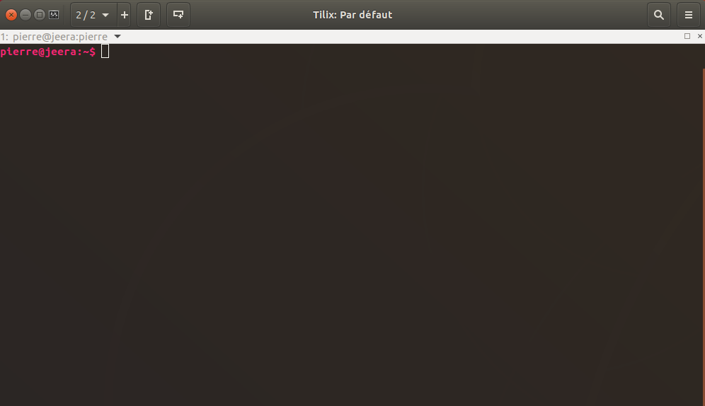
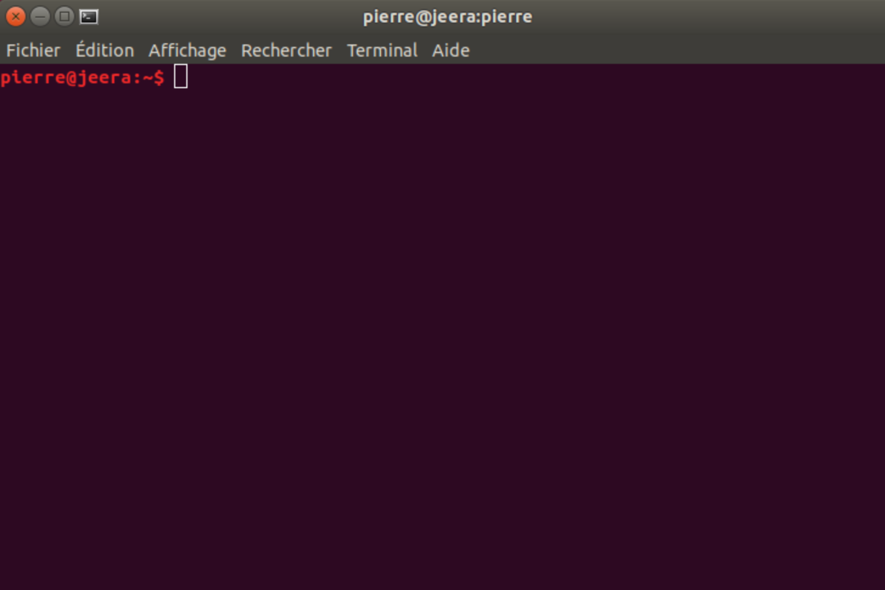
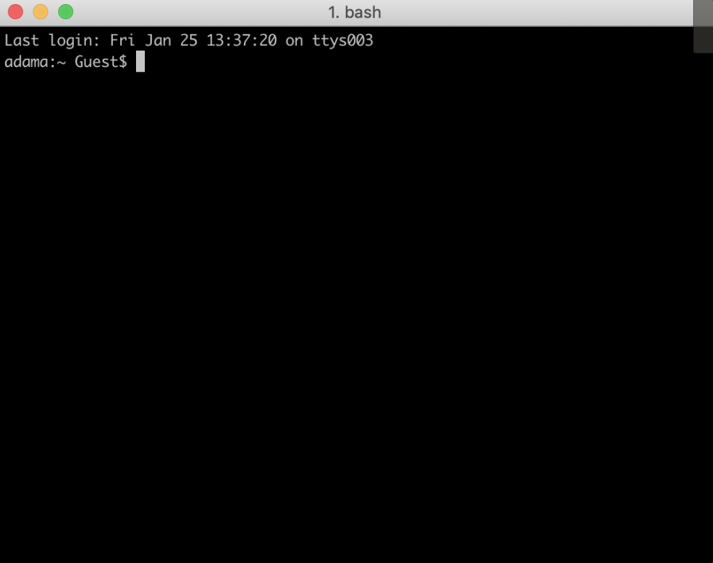
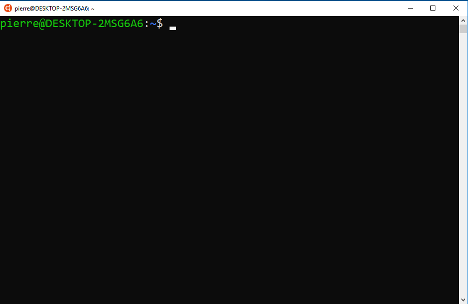
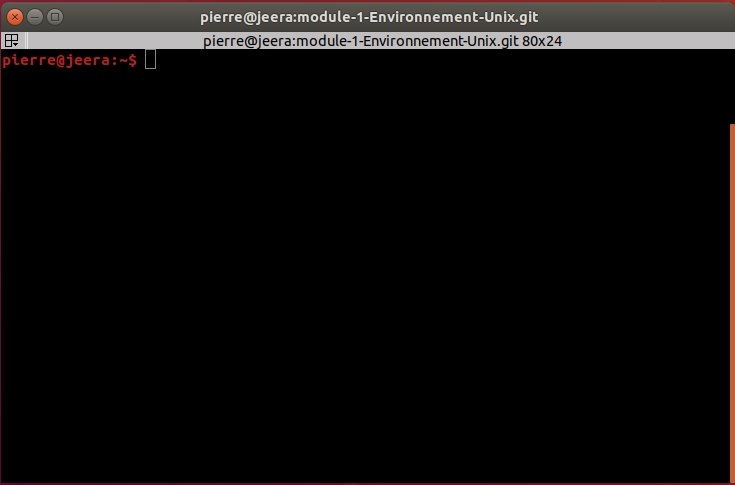
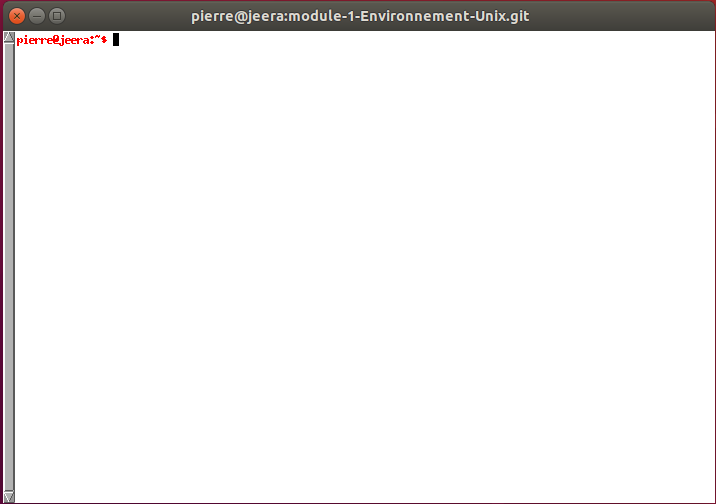
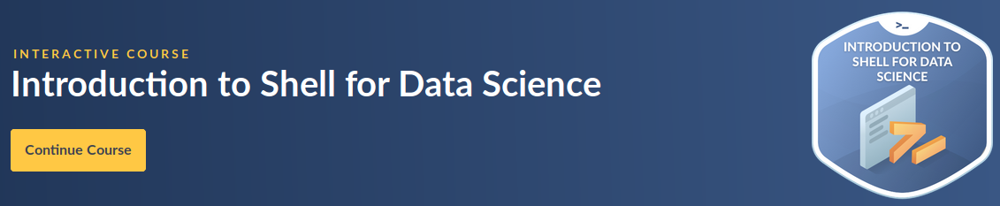
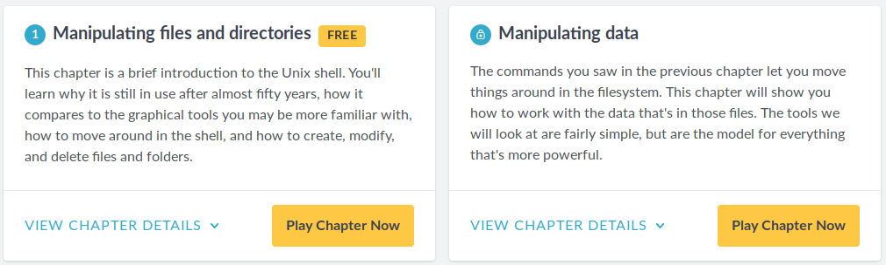

class: center, middle

# Le shell Unix

### DU Omiques

Pierre Poulain / @pierrepo

      

 </img>

 </img>

.footer[
Sauf mention contraire, ce contenu est mise à disposition selon les termes de la Licence Creative Commons Attribution 4.0 International (CC BY 4.0).
]

---

layout: true
name: title
class: center, middle
.footer[
P. Poulain, CC BY-SA
]

---

layout: true
name: contentleft
class: top, left
.footer[
P. Poulain, CC BY-SA
]

---

layout: true
name: contentcenter
class: top, center
.footer[
P. Poulain, CC BY-SA
]

---

# Le *shell*

--

 
 

## Une interface de commandes

# 👩🏼‍💻 👨🏼‍💻

--

## robuste et puissante

# 💪  +  🚀

---

##  Une **interface** de commandes

--

---

##  Une **interface** de commandes

---

##  Une interface de **commandes**

Activité préparatoire sur [DataCamp](https://www.datacamp.com/courses/introduction-to-shell-for-data-science)

--

.right[
## 🎉 Activité [WooClap](https://www.wooclap.com/DUO)
]

---
template: contentleft

background-color: #cccccc

# C'est parti ! 🚀

## 💻 [Tutoriel maison](https://omics-school.github.io/unix/tutoriel/)

## 💻 [Tutoriel Software Carpentry](http://swcarpentry.github.io/shell-novice/)

--

## 💻 Entrer dans la matrice ?

.center[

]
