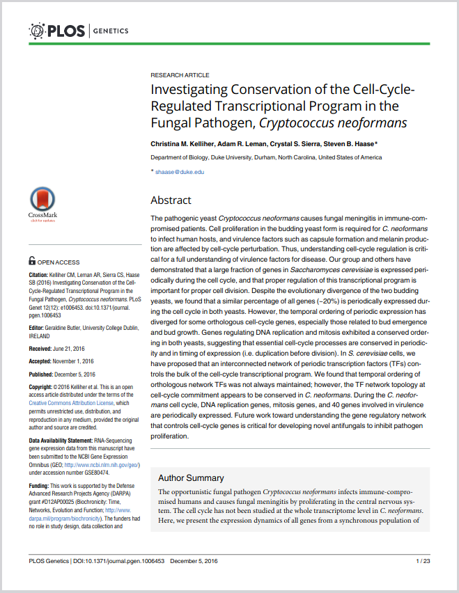

# Introduction et contexte



L'objectif de ce tutoriel est de reproduire les résultats de l'article [*Investigating Conservation of the Cell-Cycle-Regulated Transcriptional Program in the Fungal Pathogen, Cryptococcus neoformans*](https://journals.plos.org/plosgenetics/article?id=10.1371/journal.pgen.1006453) (Kelliher *et al.*, PLOS Genetics, 2016) obtenus pour le cycle cellulaire de *Saccharomyces cerevisiae*.

Dans la rubrique [*Supporting Information*](https://journals.plos.org/plosgenetics/article?id=10.1371/journal.pgen.1006453#sec011) de l'article, le fichier [*S1 Supporting Information Methods*](https://doi.org/10.1371/journal.pgen.1006453.s001) décrit les outils et les méthodes utilisés pour l'analyse RNA-seq.

Partant de ces informations, nous allons essayer de reproduire les différentes étapes de l'analyse RNA-seq. Nous verrons quelles sont les principales limitations et comment les contourner. Les analyses seront réalisées sur le cluster de calcul de l'IFB, mais, pour des raisons de progression pédagogique, nous n'utiliserons pas la puissance proposée par un tel cluster. Ce sera par contre l'object de la prochaine session.

### Prérequis

- Posséder un compte sur le cluster de calcul de l'IFB.
- Avoir réalisé le tutoriel [Introduction à Unix](../tuto1/tutorial.md).

### Configuration du JupyterHub

Connectez-vous au serveur JupyterHub de l'IFB.

Dans la page *Server Options*, choisissez les paramètres suivants :
- Reservation: `No reservation` 
- Account: `202304_duo`  ⚠️
- Partition: `fast`
- CPU(s): `6`  ⚠️
- Memory (in GB): `6`  ⚠️
- GPU(s): `0` `No GRES`

```{warning}
La configuration demandée pour cette session est différente de celle demandée pour l'introduction à Unix. Soyez particulièrement attentif aux paramètres `Account`, `CPU(s)` et `Memory (in GB)`.
```

### Analyse de données RNA-seq

1. [Préparer l'environnement logiciel](1_preparer_logiciels_module.md)
1. [Préparer les données](2_preparer_donnees.md)
1. [Analyser les données RNA-seq](3_analyser.md)
1. [Automatiser l'analyse RNA-seq](4_automatiser.md)

