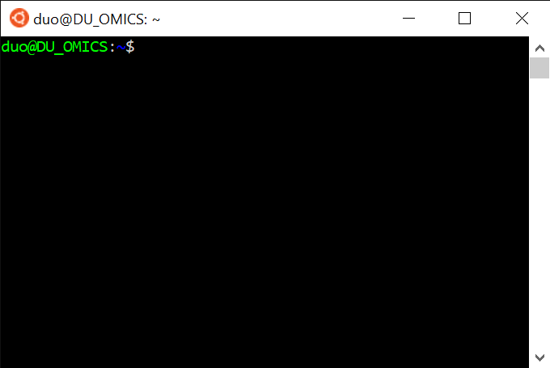

# Un aperçu rapide du shell Unix

Un *shell* est un programme qui attend un ordre de la part de l'utilisateur, exécute cet ordre, affiche le résultat puis attend à nouveau un ordre. En anglais on parle de *REPL* pour *Read Execute Print Loop*. Il existe plusieurs *shells* : *Bash*, *csh*, *zsh*... Ici on ne parlera que du *shell* *Bash* qui est le plus utilisé. Cela dit, toutes les commandes présentées ici sont communes à tous les *shells* Unix.

Lorsqu'on donne des ordres à un *shell*, on utilise ni menu, ni bouton, ni case à cocher. Tous les ordres sont **écrits** au *shell*.

Le *shell* fonctionne sur un ordinateur, qui n'a aucune capacité d'abstraction ni d'intuition. Pour que les ordres donnés au *shell* soient compris et exécutés, il faut respecter des règles bien précises :

1. Respecter la casse, c'est-à-dire l'utilisation des majuscules et des minuscules. Par exemple la commande `ls` existe mais pas `LS` ou `Ls`.
2. Comprendre que le caractère espace est utilisé pour séparer l'instruction des options et des arguments et que par conséquent **ce caractère ne doit plus être utilisé** dans les noms de fichiers ou de répertoires. 

Enfin, un terminal (ou une console) est un logiciel graphique qui lance un *shell*. C'est ce dernier (le *shell*) qui va exécuter vos ordres.


## 1. Invite de commande

Lorsque vous lancez un *shell*, l'invite de commande, c'est-à-dire la zone à gauche du curseur, ressemble à quelque chose du type :

```
pierre@jeera:~$
```
ou
```
pierre@orange $
```
ou bien encore
```
duo@DU_OMICS: $
```
voire
```
toto $
```

Par convention, l'invite de commande sera représentée dans la suite de ce document par le caractère dollar «`$`» en tout début de ligne :
```
$
```
Pour reproduire les commandes présentées, il ne faut pas taper ce caractère en début de ligne. Ainsi,
```
$ pwd
```
signifie : tapez l'instruction `pwd` dans le *shell* (sans le `$`), puis validez cette commande en pressant la touche <kbd>Entrée</kbd>.

### Lancer un *shell* Ubuntu sous Windows 10

Un *shell* Unix appelé « Ubuntu 20.04 » a déjà été installé sur votre session Windows. Vous trouverez plus de détails [ici](https://github.com/pierrepo/intro-wsl).

Pour obtenir un *shell* :

1. Cliquez sur la petite loupe en bas à gauche dans la barre de menu.
2. Tapez « Ubuntu »
3. Puis cliquez sur la proposition « Ubuntu 20.04 LTS » qui vous est faite.

La démonstration en image est [ici](img/lancement_shell_ubuntu.png).

Une fois votre terminal lancé, vous devriez obtenir ceci ou quelque chose d'équivalent :



### Retrouver le répertoire utilisateur Windows

Votre répertoire utilisateur sous le *shell* Ubuntu n'est pas au même endroit que sous Windows.

Pour vous rendre dans votre répertoire utilisateur Windows où vous avez déjà vos fichiers, lancez la commande suivante :
```
$ cd /mnt/c/Users/omics
```

🔔 Rappel : Ne tapez pas le `$` en début de ligne et faites attention aux majuscules et au minuscules (surtout pour `Users` qui débute par un *U* majuscule) !


## 2. Parcourir les répertoires et les fichiers

### Préparer les données

Pour reproduire les exemples suivants, voici les commandes à lancer pour préparer les données que vous allez utiliser :
```
$ wget https://github.com/omics-school/unix/raw/master/demo/unix.tgz
$ tar zxvf unix.tgz
$ cd unix
```

Ces commandes seront en partie expliquées plus loin. Pour ne pas réécrire complètement ces commandes, voici comment copier / coller entre Windows et le *shell* Linux :

- Pour copier depuis Windows (<kbd>Ctrl</kbd>+<kbd>C</kbd>) puis coller dans le *shell* : clic droit de la souris.
- Pour copier depuis le *shell* (<kbd>Ctrl</kbd>+<kbd>Maj</kbd>+<kbd>C</kbd>) puis coller dans Windows (<kbd>Ctrl</kbd>+<kbd>V</kbd>)


### Savoir où on se trouve : `pwd`

La première commande à connaître est la commande `pwd` qui signifie *print working directory* et qui affiche le nom du répertoire courant.

Par exemple :
```
$ pwd
/mnt/c/Users/omics/unix
```
Cela signifie qu'on se trouve actuellement dans le répertoire `/mnt/c/Users/omics/unix.

Sous Unix, les répertoires et les fichiers sont organisés sous forme d'une structure en arbre. On parle d'arborescence (voir l'[illustration](http://swcarpentry.github.io/shell-novice/02-filedir/index.html) de Software Carpentry).

Le répertoire dont dépendent tous les autres est le `/` qu'on appelle la « racine » (*root* en anglais), les différents sous-répertoires sont séparés les uns des autres par le caractère `/` (le même caractère que la racine).

Dans le cas de `/mnt/c/Users/omics/unix` :

- on se trouve dans le répertoire `unix`,
- qui est lui-même un sous-répertoire du répertoire `omics`,
- qui est lui-même un sous-répertoire du répertoire `Users`,
- qui est lui-même un sous-répertoire du répertoire `c`,
- qui est lui-même un sous-répertoire du répertoire `mnt`,
- qui est lui-même un sous-répertoire du répertoire `/` (la racine).

`/mnt/c/Users/omics/unix` est aussi appelé un « chemin » car il indique la succession des répertoires à suivre pour arriver jusqu'à `unix`. D'abord la racine `/`, puis `mnt`, puis `c`, puis `Users`, puis `omics` et enfin `unix`.

⚠️ **Attention** ⚠️ Ne confondez pas « `/` » qui tout au début d'un chemin signifie la racine de « `/` » qui sépare deux répertoires successifs.

Lorsqu'un chemin débute par `/` (la racine), on parle de **chemin absolu**. Il existe aussi des **chemins relatifs** (donc qui ne débutent pas par `/`) que l'on verra plus tard.


### Afficher le contenu d'un répertoire : `ls`

La commande `ls` (pour *list*) affiche le contenu d'un répertoire :
```
$ ls
genomes  paper.pdf  protein.txt  shopping.txt  transferrin.csv	transferrin.tsv
```

On peut modifier le comportement par défaut d'une commande avec une (ou plusieurs) option(s). Cette option est séparée de la commande par un ou plusieurs espaces.

Par exemple avec `-F` :
```
$ ls -F
genomes/  paper.pdf  protein.txt  shopping.txt	transferrin.csv  transferrin.tsv
```

Le caractère `/` a été ajouté à la fin de `genomes` pour indiquer qu'il s'agit d'un répertoire.

Remarquez que les commandes suivantes donneraient aussi le même résultats :
```
$ ls  -F
genomes/  paper.pdf  protein.txt  shopping.txt	transferrin.csv  transferrin.tsv
```
et pourquoi pas :
```
$ ls                                            -F
genomes/  paper.pdf  protein.txt  shopping.txt	transferrin.csv  transferrin.tsv
```

Retenez qu'il faut au moins un espace entre une commande et son option.

Une autre option sympa est l'option `-l` (lettre *l* en minuscule) qui affiche des informations complémentaires sur le contenu du répertoire :
```
$ ls -l
total 116
drwxr-xr-x 2 ppoulain omicsschool  4096 Mar 13 08:58 genomes
-rw-r--r-- 1 ppoulain omicsschool 97830 Mar 13 14:34 paper.pdf
-rw-r--r-- 1 ppoulain omicsschool   144 Mar 13 15:00 protein.txt
-rw-r--r-- 1 ppoulain omicsschool    45 Mar 13 09:39 shopping.txt
-rw-r--r-- 1 ppoulain omicsschool   940 Mar 13 14:19 transferrin.csv
-rw-r--r-- 1 ppoulain omicsschool   940 Mar 12 23:47 transferrin.tsv
```

L'option `-l` peut être associée à l'option `-h` pour afficher des tailles en octets, kilo, mega et giga octets.
```
$ ls -l -h
total 116K
drwxr-xr-x 2 ppoulain omicsschool 4.0K Mar 13 08:58 genomes
-rw-r--r-- 1 ppoulain omicsschool  96K Mar 13 14:34 paper.pdf
-rw-r--r-- 1 ppoulain omicsschool  144 Mar 13 15:00 protein.txt
-rw-r--r-- 1 ppoulain omicsschool   45 Mar 13 09:39 shopping.txt
-rw-r--r-- 1 ppoulain omicsschool  940 Mar 13 14:19 transferrin.csv
-rw-r--r-- 1 ppoulain omicsschool  940 Mar 12 23:47 transferrin.tsv
```
Le fichier `paper.pdf` a une taille de 96 kilo octets.

Les options peuvent aussi être combinées :
```
$ ls -lh
total 116K
drwxr-xr-x 2 ppoulain omicsschool 4.0K Mar 13 08:58 genomes
-rw-r--r-- 1 ppoulain omicsschool  96K Mar 13 14:34 paper.pdf
-rw-r--r-- 1 ppoulain omicsschool  144 Mar 13 15:00 protein.txt
-rw-r--r-- 1 ppoulain omicsschool   45 Mar 13 09:39 shopping.txt
-rw-r--r-- 1 ppoulain omicsschool  940 Mar 13 14:19 transferrin.csv
-rw-r--r-- 1 ppoulain omicsschool  940 Mar 12 23:47 transferrin.tsv
```

Une combinaison d'options intéressantes est `-lhrt` qui affiche en dernier (en bas de la liste) le fichier modifié le plus récemment :
```
$ ls -lhrt
total 116K
-rw-r--r-- 1 ppoulain omicsschool  940 Mar 12 23:47 transferrin.tsv
drwxr-xr-x 2 ppoulain omicsschool 4.0K Mar 13 08:58 genomes
-rw-r--r-- 1 ppoulain omicsschool   45 Mar 13 09:39 shopping.txt
-rw-r--r-- 1 ppoulain omicsschool  940 Mar 13 14:19 transferrin.csv
-rw-r--r-- 1 ppoulain omicsschool  96K Mar 13 14:34 paper.pdf
-rw-r--r-- 1 ppoulain omicsschool  144 Mar 13 15:00 protein.txt
```
L'option `-t` affiche les fichiers du plus récent au plus ancien et l'option `-r` inverse cet ordre. Ici, le dernier fichier modifié est `protein.txt`.

L'option `-a` affiche tout le contenu du répertoire courant, notamment les fichiers et répertoires cachés qui commencent (sous Unix) par le caractère `.` :
```
$ ls -a
.  ..  genomes	paper.pdf  protein.txt	shopping.txt  transferrin.csv  transferrin.tsv
```

Par défaut, il y a deux répertoires cachés qui sont toujours présents : `.` et `..`

Le répertoire `.` désigne le répertoire courant.

Le répertoire `..` désigne le répertoire parent. Par exemple, si on est dans le répertoire `/mnt/c/Users/omics/unix`, alors `..` désigne le répertoire `/mnt/c/Users/omics`.

Enfin, la commande `ls` peut aussi afficher le contenu d'un répertoire passé en argument :
```
$ ls genomes
NC_000907_head.gbk  NC_004459_head.gbk  NC_007168_head.gbk  NC_011333_head.gbk
NC_000964_head.gbk  NC_004461_head.gbk  NC_007350_head.gbk  NC_011852_head.gbk
NC_002505_head.gbk  NC_004917_head.gbk  NC_009033_head.gbk  NC_012655_head.gbk
NC_002570_head.gbk  NC_006298_head.gbk  NC_009477_head.gbk  NC_013893_head.gbk
NC_002976_head.gbk  NC_006840_head.gbk  NC_011184_head.gbk  NC_014205_head.gbk
```

Comme pour les options, il faut au moins un espace entre une commande et son ou ses arguments.

On peut même d'obtenir des informations détaillées sur un fichier en particulier :
```
$ ls -lh paper.pdf
-rw-r--r-- 1 pierre pierre 96K mars  13 14:34 paper.pdf
```


### Se documenter : `man` et `--help`

La commande `man` (pour *manuel*) affiche l'aide associée à une commande. Par exemple pour la commande `ls` :
```
$ man ls
```
Utilisez les flèches <kbd>↓</kbd> et <kbd>↑</kbd> pour naviguer dans cette aide. La touche <kbd>Espace</kbd> saute une page à la fois. La touche <kbd>Q</kbd> quitte l'aide et revient au *shell*.

Par ailleurs, de nombreuses commandes Unix disposent de l'option `--help` qui affiche un aide succinct :
```
$ ls --help
Usage: ls [OPTION]... [FILE]...
List information about the FILEs (the current directory by default).
Sort entries alphabetically if none of -cftuvSUX nor --sort is specified.

Mandatory arguments to long options are mandatory for short options too.
  -a, --all                  do not ignore entries starting with .
  -A, --almost-all           do not list implied . and ..
      --author               with -l, print the author of each file
  -b, --escape               print C-style escapes for nongraphic characters
      --block-size=SIZE      scale sizes by SIZE before printing them; e.g.,

...
```


### Prêter attention aux noms de fichiers et répertoires

Sous Unix, les noms de fichiers et de répertoires sont sensibles à la casse, c'est-à-dire aux majuscules et aux minuscules. Par conséquent, le *shell* fait la différence entre le fichier `test.txt` et le fichier `Test.txt`.

Par ailleurs, l'extension de fichier est facultative et purement indicative. Le *shell* ne l'utilise pas. Elle sert simplement à l'utilisateur pour mieux organiser ses fichiers. Un nom de fichier du type `test` ou `test.my_extension` est parfaitement valide. On peut même nommer un répertoire `directory.txt` (mais ça n'est pas très malin 🙄).

Enfin, pour nommer un fichier ou un répertoire, on peut utiliser :

- les lettres minuscules,
- les lettres majuscules,
- les chiffres,
- le tiret du milieu «`-`» (mais pas comme premier caractère du nom),
- le tiret du bas «`_`»,
- le point «`.`».

On vous déconseille fortement l'utilisation des autres caractères (`+()[]éèàùç`). Certains caractères sont même interdits (`<>|;&`).

Enfin, ne mettez **jamais** un espace dans un nom de fichier ou de répertoire. **J-A-M-A-I-S**. Unix l'autorise mais c'est très très pénible par la suite car l'espace est utilisé pour séparer les options et les arguments d'une commande.

Pour le reste, laisser faire votre imagination et utilisez des noms de fichiers et de répertoires expressifs.


### Se déplacer : `cd`

La commande `cd` (pour *change directory*) permet de se déplacer d'un répertoire à l'autre. Par exemple :
```
$ pwd
/mnt/c/Users/omics/unix
$ cd genomes
$ pwd
/mnt/c/Users/omics/unix/genomes
```
Partant du répertoire `/mnt/c/Users/omics/unix`, on s'est déplacé dans le répertoire `/mnt/c/Users/omics/unix/genomes`.

Dans la commande `cd genomes`, le répertoire `genomes` est un argument de la commande `cd`.

Dans la commande `cd genomes`, le répertoire `genomes` est un chemin relatif (car il ne débute pas par `/`). C'est-à-dire qu'on a entré le nom de ce répertoire (`genomes`) par rapport au répertoire dans lequel nous étions (`/mnt/c/Users/omics/unix`). Bien sûr, la commande `cd` fonctionne très bien avec un chemin absolu. La commande
```
$ cd /mnt/c/Users/omics/unix/genomes
```
conduirait au même résultat.

Un moyen simple de revenir dans le répertoire parent est d'utiliser le raccourci `..` :
```
$ pwd
/mnt/c/Users/omics/unix/genomes
$ cd ..
$ pwd
/mnt/c/Users/omics/unix
```

Un autre raccourci pratique pour revenir dans le répertoire utilisateur (répertoire par défaut dans lequel se trouve l'utilisateur lorsqu'il lance un *shell*) est `~` :
```
$ pwd
/mnt/c/Users/omics/unix
$ cd ~
$ pwd
/home/duo
```

Remarque : 

- Simplement taper la commande `cd` (sans argument) ramène aussi l'utilisateur dans son répertoire personnel.
- Dans votre situation ce n'est pas très pratique car votre répertoire utilisateur dans le *shell* Ubuntu (`/home/duo`) est différent de celui sous Windows (`/mnt/c/Users/omics/`) et c'est dans ce dernier que vous souhaitez travailler.


### Créer un répertoire : `mkdir`

La commande `mkdir` (pour *make directory*) crée un répertoire :
```
$ ls
genomes  paper.pdf  protein.txt  shopping.txt  transferrin.csv	transferrin.tsv
$ mkdir test
$ ls
genomes  paper.pdf  protein.txt  shopping.txt  test  transferrin.csv  transferrin.tsv
```

### Copier : `cp`

La commande `cp` (pour *copy*) copie un fichier vers un nouveau fichier :
```
$ ls
genomes  paper.pdf  protein.txt  shopping.txt  test  transferrin.csv  transferrin.tsv
$ cp paper.pdf article.pdf
$ ls
article.pdf  genomes  paper.pdf  protein.txt  shopping.txt  test  transferrin.csv  transferrin.tsv
```

`cp` peut copier plusieurs fichiers dans un répertoire :
```
$ cp paper.pdf article.pdf test
$ ls test
article.pdf  paper.pdf
```

`cp` peut aussi copier un répertoire dans un autre répertoire avec l'option `-r` :
```
$ cp -r genomes test
$ ls test
article.pdf  genomes  paper.pdf
```


### Renommer et déplacer : `mv`

La commande `mv` (pour *move*) renommer des fichiers ou des répertoires :
```
$ ls
article.pdf  genomes  paper.pdf  protein.txt  shopping.txt  test  transferrin.csv  transferrin.tsv
$ mv article.pdf article2.pdf
$ ls
article2.pdf  genomes  paper.pdf  protein.txt  shopping.txt  test  transferrin.csv  transferrin.tsv
$ mv test test2
$ ls
article2.pdf  genomes  paper.pdf  protein.txt  shopping.txt  test2  transferrin.csv  transferrin.tsv
```

`mv` déplace aussi des fichiers ou des répertoires dans un autre répertoire :
```
$ ls
article2.pdf  genomes  paper.pdf  protein.txt  shopping.txt  test2  transferrin.csv  transferrin.tsv
$ mkdir test3
$ mv article2.pdf test2 test3
$ ls test3
article2.pdf  test2
$ ls
genomes  paper.pdf  protein.txt  shopping.txt  test3  transferrin.csv  transferrin.tsv
```


### Supprimer : `rm`

La commande `rm` (pour *remove*) supprime des fichiers ou des répertoires :
```
$ cd test3
$ ls
article2.pdf  test2
$ rm article2.pdf
$ ls
test2
$ rm -r test2
$ ls
```

Pour supprimer un répertoire, il faut utiliser l'option supplémentaire `-r`.

Suivant la configuration de votre *shell*, il faudra peut être ajouter l'option `-f` pour que la suppression fonctionne.

⚠️ **Attention** ⚠️ Il n'y a pas de corbeille dans le *shell* Unix, c'est-à-dire aucune possibilité de récupérer un fichier ou un répertoire effacé par erreur. Pensez à sauvegarder régulièrement vos fichiers.


### Automatiser (un peu)

Les caractères `*` et `?` peuvent remplacer n'importe quels caractères dans les noms de fichiers ou de répertoires.

`*` remplace 0, 1 ou plus caractères.

`?` remplace exactement 1 caractère.

Par exemple :
```
$ ls *txt
protein.txt  shopping.txt
$ ls transferrin.?sv
transferrin.csv  transferrin.tsv
```

Ces caractères sont très utiles quand il s'agit d'effectuer une opération sur plusieurs fichiers en même temps :
```
$ mkdir test4
$ cp transferrin.* test4
$ ls test4
transferrin.csv  transferrin.tsv
```

La commande `cp transferrin.* test4` est un raccourci pour
```
cp transferrin.csv  transferrin.tsv test4
```

Cela fonctionne avec autant de fichiers qu'on le souhaite.


## 3. Trucs et astuces

Écrire des commandes dans un *shell* peut sembler rébarbatif mais on gagne rapidement en efficacité avec les astuces suivantes.

### Rappel des anciennes commandes

La flèche du haut <kbd>↑</kbd> rappelle les commandes précédentes (depuis la plus récente jusqu'à la plus ancienne).

### Complétion automatique

La touche tabulation <kbd>Tab</kbd> est utile pour compléter une commande, un nom de répertoire ou de fichier. Appuyez deux fois sur <kbd>Tab</kbd> en cas d’ambiguïté.

Par exemple, si vous tapez `/h` puis la touche <kbd>Tab</kbd> et le *shell* va compléter automatiquement à `/home`.

### Arrêter une commande en cours

Pressez la touche <kbd>Ctrl</kbd> et la touche <kbd>C</kbd> en même temps pour arrêter une commande en cours.

### Copier / coller

Pour copier / coller quelque chose dans le *shell*, utilisez les combinaisons de touches <kbd>Ctrl</kbd>+<kbd>Maj</kbd>+<kbd>C</kbd> et <kbd>Ctrl</kbd>+<kbd>Maj</kbd>+<kbd>V</kbd>.


## 4. Explorer le contenu de fichiers

Jusqu'à présent, on s'est contenté d'afficher le contenu de répertoires et de déplacer ou copier des fichiers, sans connaître leur contenu.

Pour afficher le contenu d'un fichier, on utilise la commande `cat` (pour *concatenate*) :
```
$ cat shopping.txt
banana 6
pineaple 1
pear 3
apple 10
orange 4
```

Bien sûr, afficher le contenu d'un fichier n'a de sens ici que pour un fichier texte. En effet, afficher le contenu d'un fichier binaire produit une suite de caractères incompréhensibles :
```
$ cat paper.pdf
�{����e˿\�><?�S�;gg��>��ݻ���7��h�G�.�}{�������W[��5��͓����d�=8��f.���屌J�Y��b�ꂭ貾l���/ٙ�
xrefbjfalse/SM 0.02/Type/ExtGState>>
0 1
0000000000 65535 f
11 2
0000073672 00000 n
0000077288 00000 n
15 1
0000077496 00000 n
48 4
0000077860 00000 n
0000097345 00000 n
0000097389 00000 n
0000097434 00000 n
trailer
<</Size 52/Root 14 0 R/Info 12 0 R/ID[<C52AD85A8BAFBD722C6FCD30421B945E><33F927FA361D6A4FA1263C03468E9074>]/Prev 116>>
startxref
97487
%%EOF
```

*Remarque* : Évitez de lancer la commande précédente. Vous risquez de perdre la main dans votre *shell* et devoir le relancer (en fermant la fenêtre puis en ouvrant une nouvelle).

⚠️ **Attention** ⚠️ Dans la suite, nous n'explorerons que le contenu de **fichiers textes**.

La commande `cat` n'a de sens que si le fichier est assez court. Si ce n'est pas le cas, le contenu du fichier va défiler d'un seul coup à l'écran, sans qu'on puisse en voir le début. Par exemple :
```
$ cat transferrin.csv
1TFD,Oryctolagus cuniculus,304
2D3I,Gallus gallus,686
2O84,Homo sapiens,337
3FGS,Homo sapiens,337
3QYT,Homo sapiens,679
3SKP,Homo sapiens,342
4H0W,Homo sapiens,679
4X1B,Homo sapiens,679
5H52,Homo sapiens,679
5WTD,Homo sapiens,679
5X5P,Homo sapiens,679
6CTC,Homo sapiens,679
...
```

Pour les gros fichiers, on préfère utiliser la commande `less` qui affiche *progressivement* le contenu d'un fichier :
```
$ less transferrin.csv
```

Comme avec la commande `man`, les flèches <kbd>↓</kbd> et <kbd>↑</kbd> permettent de naviguer dans le contenu du fichier. La touche <kbd>Espace</kbd> saute une page à la fois. La touche <kbd>Q</kbd> quitte `less` et revient au *shell*.

La commande `head` affiche les premières lignes d'un fichier :
```
$ head transferrin.csv
1A8E,Homo sapiens,329
1A8F,Homo sapiens,329
1AIV,Gallus gallus,686
1AOV,Anas platyrhynchos,686
1B3E,Homo sapiens,330
1D3K,Homo sapiens,329
1D4N,Homo sapiens,329
1DOT,Anas platyrhynchos,686
1DTG,Homo sapiens,334
1FQE,Homo sapiens,331
```

Par défaut, `head` affiche les 10 premières lignes du fichier. L'option `-n` précise le nombre de lignes à afficher. Par exemple :
```
$ head -n 2 transferrin.csv
1A8E,Homo sapiens,329
1A8F,Homo sapiens,329
```

Réciproquement, la commande `tail` affiche les dernières lignes d'un fichier texte. L'option `-n` est également disponible :
```
$ tail transferrin.csv
2O84,Homo sapiens,337
3FGS,Homo sapiens,337
3QYT,Homo sapiens,679
3SKP,Homo sapiens,342
4H0W,Homo sapiens,679
4X1B,Homo sapiens,679
5H52,Homo sapiens,679
5WTD,Homo sapiens,679
5X5P,Homo sapiens,679
6CTC,Homo sapiens,679
```
```
$ tail -n 2 transferrin.csv
5X5P,Homo sapiens,679
6CTC,Homo sapiens,679
```

## 5. Créer ou éditer un fichier texte

Nano est un éditeur de texte qui fonctionne dans un *shell*, donc sans interface graphique, sans menu, sans icône, contrairement à des éditeurs de texte comme Notepad++.

Pour le lancer, on utilise la commande `nano` :

```
$ nano
```

Et on obtient quelque chose du type :


Selon la version de votre système Unix, il se peut que l'interface soit en anglais mais les raccourcis clavier seront les mêmes.

On peut tout de suite commencer à taper du texte.

Pour sauvegarder le texte ainsi entré dans nano, on utilise la combinaison de touches <kbd>Ctrl</kbd>+<kbd>O</kbd> (c'est-à-dire qu'on presse en même temps les touches <kbd>Ctrl</kbd> et <kbd>O</kbd>). On entre ensuite le nom qu'on souhaite donner au fichier (par exemple `test.txt`) puis on valide par la touche  <kbd>Entrée</kbd>.

Les différentes combinaisons de touches sont rappelées en bas de l'écran. Le caractère « `^` » désigne la touche <kbd>Ctrl</kbd>.

On peut continuer à éditer le fichier puis l'enregistrer, et ainsi de suite.

Pour quitter nano, on utilise la combinaison de touches <kbd>Ctrl</kbd>+<kbd>X</kbd>.

On se retrouve alors dans le *shell* et on peut vérifier que le fichier (ici `test.txt`) a bien été créé dans le répertoire courant.

```
$ ls
genomes  paper.pdf  protein.txt  shopping.txt  test.txt  transferrin.csv  transferrin.tsv
```

On peut aussi ouvrir un fichier texte existant en indiquant en argument le nom du fichier à ouvrir :

```
$ nano shopping.txt
```


## 6. Manipuler des données

### Compter : `wc`

La commande `wc` (pour *word count*) compte le nombre de caractères, de mots et de lignes d'un fichier.
```
$ wc shopping.txt
 5 10 45 shopping.txt
```
On apprend ainsi que le fichier `shopping.txt` contient 5 lignes, 10 mots et 45 caractères.

L'option `-l` indique à la commande `wc` de ne compter que le nombre de lignes. Et réciproquement pour `-w` et le nombre de mots, et `-c` et le nombre de caractères.

Lorsque plusieurs fichiers sont fournis en argument à `wc`, le total est aussi renvoyé :
```
$ wc -l transferrin.*
  41 transferrin.csv
  41 transferrin.tsv
  82 total
```
Les fichiers `transferrin.csv` et `transferrin.tsv` contiennent chacun 41 lignes, soit un total de 82 lignes.


### Trier : `sort`

La commande `sort` trie le contenu d'un fichier.

```
$ cat shopping.txt
banana 6
pineaple 1
pear 3
apple 10
orange 4
```

```
$ sort shopping.txt
apple 10
banana 6
orange 4
pear 3
pineaple 1
```

Les lignes ont été triées par ordre alphabétique.

La commande `sort` a également la notion de colonnes (ou de champs). Par défaut, le séparateur de champs est un caractère blanc (espace, tabulation). Dans le fichier `shopping.txt`, `sort` trouve une première colonne avec le nom des fruits et une seconde avec les quantités.

On peut trier le fichier `shopping.txt` suivant le nombre de fruits en indiquant à `sort` d'utiliser la 2e colonne avec l'option `-k` :
```
$ sort -k 2 shopping.txt
pineaple 1
apple 10
pear 3
orange 4
banana 6
```
Les lignes sont alors triées suivant la seconde colonne, mais par ordre alphabétique, ce qui explique que `10` soit avant `3`. Pour trier explicitement sur des valeurs numériques, on utilise l'option `-g` :
```
$ sort -k 2 -g shopping.txt
pineaple 1
pear 3
orange 4
banana 6
apple 10
```
L'ordre numérique est ainsi respecté.

Enfin l'option `-r` inverse le tri initial :
```
$ sort -r shopping.txt
pineaple 1
pear 3
orange 4
banana 6
apple 10
```

```
$ sort -k 2 -g -r shopping.txt
apple 10
banana 6
orange 4
pear 3
pineaple 1
```

### Trouver les éléments uniques : `uniq`

La commande `uniq` affiche les éléments uniques.

Par exemple avec le contenu du fichier `protein.txt` :
```
$ cat protein.txt
insulin
insulin
insulin
insulin
insulin
insulin
integrin
integrin
rhodopsin
rhodopsin
rhodopsin
transferrin
transferrin
transferrin
transferrin
```

```
$ uniq protein.txt
insulin
integrin
rhodopsin
transferrin
```

L'option `-c` compte le nombre de fois qu'un élément est présent :
```
$ uniq -c protein.txt
      6 insulin
      2 integrin
      3 rhodopsin
      4 transferrin
```

*Remarque* : La commande `uniq` ne fonctionne que sur un fichier trié, c'est-à-dire pour lequel les lignes sont déjà triées par ordre alphabétique.


### Extraire un colonne : `cut`

La commande `cut` extrait une colonne particulière d'un fichier.

Par exemple avec le fichier `transferrin.csv` qui contient les identifiants PDB de structures de transferrines, avec l'organisme d'origine et le nombre d'acides aminés de la structure :

```
$ head -n 5 transferrin.csv
1A8E,Homo sapiens,329
1A8F,Homo sapiens,329
1AIV,Gallus gallus,686
1AOV,Anas platyrhynchos,686
1B3E,Homo sapiens,330
```

On souhaite extraire la 2e colonne qui contient des noms d'organismes :
```
$ cut -d "," -f 2 transferrin.csv
Homo sapiens
Homo sapiens
Gallus gallus
Anas platyrhynchos
Homo sapiens
Homo sapiens
...
```

L'option `-d` spécifie le délimiteur, c'est-à-dire le caractère utilisé pour séparer les différents champs (les colonnes). Par défaut, `cut` utilise la tabulation.

L'option `-f` précise le numéro du champ qu'on souhaite extraire.


### Gérer les flux : redirection et emboîtement

On souhaite extraire du fichier `transferrin.csv` la liste des différents organismes d'où proviennent les structures de transferrines. On a besoin pour cela de réaliser 3 étapes :

1. Extraire la liste des organismes (avec `cut`).
2. Trier par ordre alphabétique ces organismes (avec `sort`).
3. Trouver les différents organismes (avec `uniq`). L'étape 2 est justifiée par le fait que `uniq` ne fonctionne que sur des données triées.

Pour stocker l'information, d'une étape à l'autre, on peut renvoyer le résultat dans un fichier avec la redirection «`>`».

#### Étape 1 (`cut`)
```
$ cut -d "," -f 2 transferrin.csv > organism.txt
```
Le résultat de la commande ne s'affiche pas à l'écran mais est redirigé dans le fichier `organism.txt`.

On peut jeter un oeil au contenu de `organism.txt` avec les commandes `cat`, `less`, `head` ou `tail` :
```
$ head organism.txt
Homo sapiens
Homo sapiens
Gallus gallus
Anas platyrhynchos
Homo sapiens
Homo sapiens
Homo sapiens
Anas platyrhynchos
Homo sapiens
Homo sapiens
```

#### Étape 2 (`sort`)
```
$ sort organism.txt > organism_sorted.txt
```

Ici encore, rien ne s'affiche à l'écran mais on peut contrôler le résultat :
```
$ head organism_sorted.txt
Anas platyrhynchos
Anas platyrhynchos
Gallus gallus
Gallus gallus
Gallus gallus
Gallus gallus
Gallus gallus
Gallus gallus
Gallus gallus
```

#### Étape 3 (`uniq`)
```
$ uniq organism_sorted.txt
Anas platyrhynchos
Gallus gallus
Homo sapiens
Oryctolagus cuniculus
Sus scrofa
```

Les structures de transferrines du fichier `transferrin.csv` proviennent de 5 organismes différents.

Pour cette analyse, nous avons dû créer deux fichiers intermédiaires : `organism.txt` et `organism_sorted.txt`.

Pour éviter la création de ces fichiers et réaliser cette analyse en une seule fois, on emboîte (« chaîne ») les différentes étapes. La sortie produite par une étape devient l'entrée de l'étape suivante (voir l'[illustration](http://swcarpentry.github.io/shell-novice/04-pipefilter/index.html) de Software Carpentry). On utilise pour cela  «`|`» :

```
$ cut -d "," -f 2 transferrin.csv | sort | uniq
Anas platyrhynchos
Gallus gallus
Homo sapiens
Oryctolagus cuniculus
Sus scrofa
```

On obtient le même résultat que précédemment mais en une seule étape.

Si on souhaite obtenir le nombre de structures par organisme, on peut très rapidement modifier la commande précédente :
```
$ cut -d "," -f 2 transferrin.csv | sort | uniq -c
      2 Anas platyrhynchos
     10 Gallus gallus
     26 Homo sapiens
      2 Oryctolagus cuniculus
      1 Sus scrofa
```

Et si on préfère travailler avec le fichier `transferrin.tsv` dont les colonnes sont séparées par des tabulations :
```
$ cut -f 2 transferrin.tsv | sort | uniq -c
      2 Anas platyrhynchos
     10 Gallus gallus
     26 Homo sapiens
      2 Oryctolagus cuniculus
      1 Sus scrofa
```


## 7. Chercher


### Chercher dans des fichiers : `grep`

La commande `grep` cherche un motif dans un ou plusieurs fichiers et renvoie les lignes correspondantes :
```
$ grep "apple" shopping.txt
apple 10
```

Le motif à rechercher est indiqué entre guillemets.

L'option `-n` affiche le numéro de la ligne dans lequel est trouvé le motif :
```
$ grep -n "apple" shopping.txt
4:apple 10
```

Si on recherche un motif dans plusieurs fichiers, le nom des fichiers dans lequel le motif est trouvé est également affiché :

```
$ grep "DEFI" genomes/*.gbk
genomes/NC_000907_head.gbk:DEFINITION  Haemophilus influenzae Rd KW20, complete genome.
genomes/NC_000964_head.gbk:DEFINITION  Bacillus subtilis subsp. subtilis str. 168, complete genome.
genomes/NC_002505_head.gbk:DEFINITION  Vibrio cholerae O1 biovar El Tor str. N16961 chromosome I, complete
genomes/NC_002570_head.gbk:DEFINITION  Bacillus halodurans C-125, complete genome.
genomes/NC_002976_head.gbk:DEFINITION  Staphylococcus epidermidis RP62A, complete genome.
genomes/NC_004459_head.gbk:DEFINITION  Vibrio vulnificus CMCP6 chromosome I, complete genome.
genomes/NC_004461_head.gbk:DEFINITION  Staphylococcus epidermidis ATCC 12228, complete genome.
genomes/NC_004917_head.gbk:DEFINITION  Helicobacter hepaticus ATCC 51449, complete genome.
genomes/NC_006298_head.gbk:DEFINITION  Haemophilus somnus 129PT plasmid pHS129, complete sequence.
genomes/NC_006840_head.gbk:DEFINITION  Vibrio fischeri ES114 chromosome I, complete genome.
genomes/NC_007168_head.gbk:DEFINITION  Staphylococcus haemolyticus JCSC1435, complete genome.
genomes/NC_007350_head.gbk:DEFINITION  Staphylococcus saprophyticus subsp. saprophyticus ATCC 15305,
genomes/NC_009033_head.gbk:DEFINITION  Staphylothermus marinus F1 chromosome, complete genome.
genomes/NC_009477_head.gbk:DEFINITION  Staphylococcus aureus subsp. aureus JH9 plasmid pSJH901, complete
genomes/NC_011184_head.gbk:DEFINITION  Vibrio fischeri MJ11 chromosome I, complete sequence.
genomes/NC_011333_head.gbk:DEFINITION  Helicobacter pylori G27, complete genome.
genomes/NC_011852_head.gbk:DEFINITION  Haemophilus parasuis SH0165, complete genome.
genomes/NC_012655_head.gbk:DEFINITION  Bacillus anthracis str. A0248 plasmid pXO2, complete sequence.
genomes/NC_013893_head.gbk:DEFINITION  Staphylococcus lugdunensis HKU09-01 chromosome, complete genome.
genomes/NC_014205_head.gbk:DEFINITION  Staphylothermus hellenicus DSM 12710 chromosome, complete genome.
```

On peut bien sûr emboîter / chaîner les commandes `grep` si on cherche plusieurs motifs :
```
$ grep "DEFI" genomes/*.gbk | grep "Staphyloco"
genomes/NC_002976_head.gbk:DEFINITION  Staphylococcus epidermidis RP62A, complete genome.
genomes/NC_004461_head.gbk:DEFINITION  Staphylococcus epidermidis ATCC 12228, complete genome.
genomes/NC_007168_head.gbk:DEFINITION  Staphylococcus haemolyticus JCSC1435, complete genome.
genomes/NC_007350_head.gbk:DEFINITION  Staphylococcus saprophyticus subsp. saprophyticus ATCC 15305,
genomes/NC_009477_head.gbk:DEFINITION  Staphylococcus aureus subsp. aureus JH9 plasmid pSJH901, complete
genomes/NC_013893_head.gbk:DEFINITION  Staphylococcus lugdunensis HKU09-01 chromosome, complete genome.
```

L'option `-c` de `grep` indique combien de génomes de staphylocoques ont été trouvés :
```
$ grep "DEFI" genomes/*.gbk | grep -c "Staphyloco"
6
```


### Chercher des fichiers : `find`

La commande `find` recherche des fichiers ou des répertoires.

On revient tout d'abord dans le répertoire parent :
```
$ pwd
/mnt/c/Users/omics/unix
$ cd ..
$ pwd
/mnt/c/Users/omics
```

On cherche maintenant les fichiers avec l'extension `.csv` :
```
$ find ./ -name "*.csv"
./unix/transferrin.csv
```

La commande `find` prend comme argument l'endroit à partir duquel on cherche, ici le répertoire courant désigné par `./` (on aurait aussi pu simplement indiquer « `.` »). Puis on indique le critère de recherche avec l'option `-name`, ici tous les fichiers qui se terminent par `.csv`.


## 8. Se souvenir

La commande `history` affiche toutes les commandes que vous avez entrées, de la plus ancienne à la plus récente.

Ainsi, la commande
```
$ history
```
produit une sortie du type :
```
...

  582  grep "apple" shopping.txt
  583  grep -n "apple" shopping.txt
  584  grep "DEFI" genomes/*.gbk
  585  grep "DEFI" genomes/*.gbk | grep "Staphyloco"
  586  grep "DEFI" genomes/*.gbk | grep -c "Staphyloco"
  587  pwd
  588  cd ..
  589  pwd
  590  find ./ -name "*.csv"
  591  history
```

Le numéro à côté de chaque commande est le numéro de la commande dans l'ordre où elle a été lancée dans le *shell*. Vous aurez bien sûr des numéros et des commandes différentes.

On peut très simplement rappeler une commande à partir de son numéro précédé de «`!`». Par exemple :
```
$ !590
find ./ -name "*.csv"
./unix/transferrin.csv
```

Enfin, lorsqu'on a travaillé un moment dans le *shell*, il peut être utile de sauvegarder l'historique des commandes qu'on a lancées avec :
```
$ history > 2019-03-14_history.txt
```

Ici, `2019-03-14` représente la date au format [ISO 8601](https://fr.wikipedia.org/wiki/ISO_8601) `AAAA-MM-JJ` (*année-mois-jour*).
